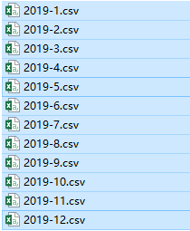
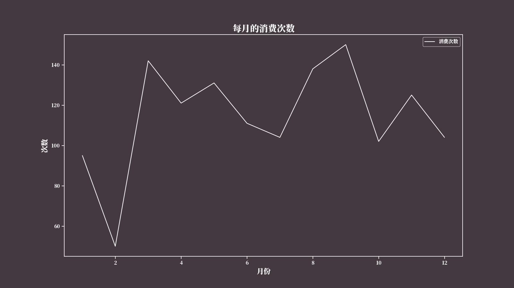
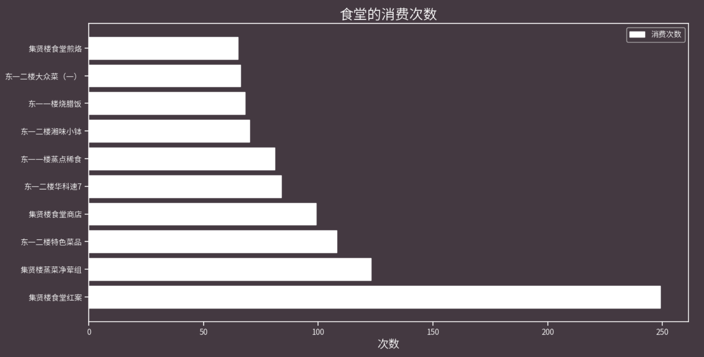
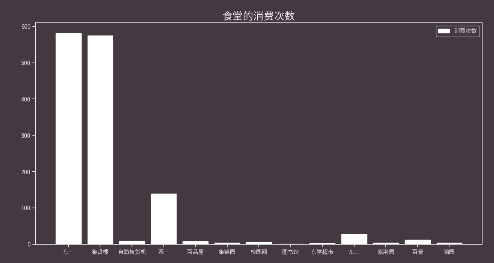
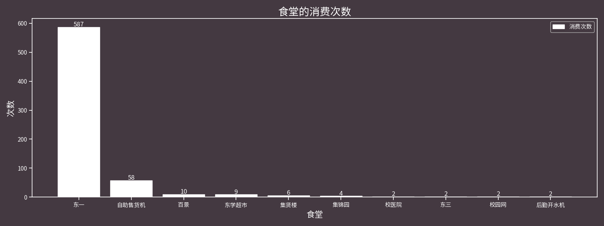
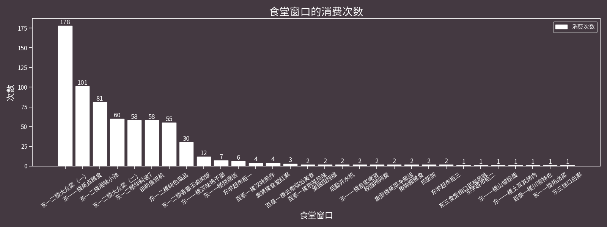
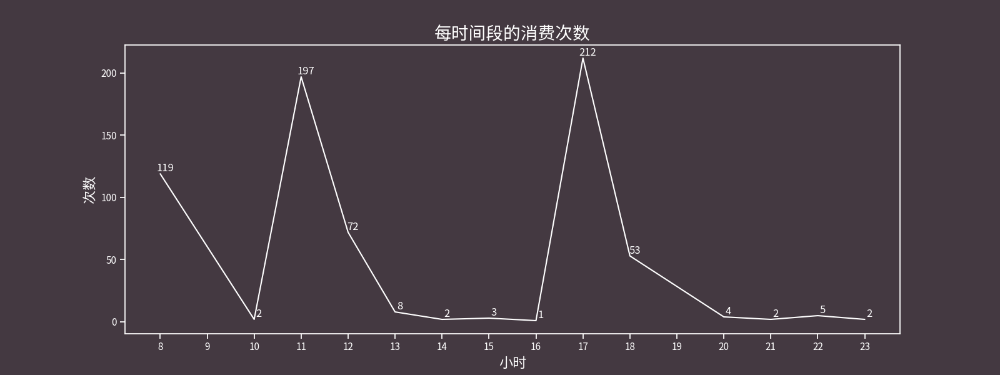
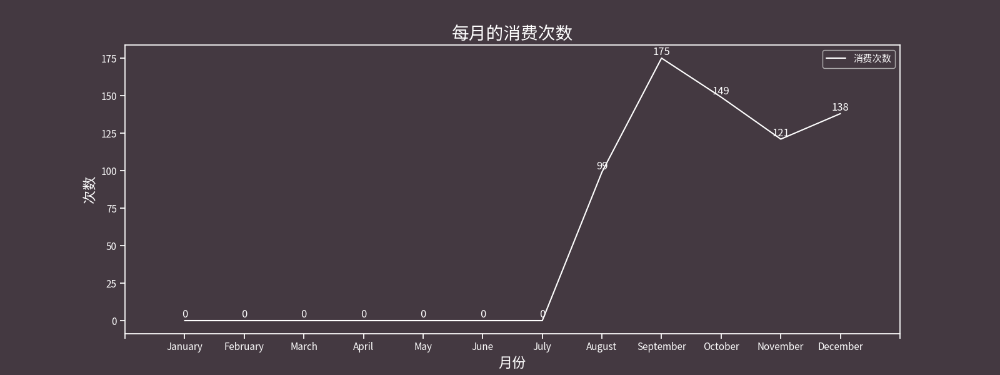

# 我到底在华科吃了些啥 （华科校园卡年度报告）


## Table of Contents

- [起因](#起因)
- [数据获取](#数据获取)
- [数据分析](#数据分析)
	- [2019 数据详情](#2019-数据详情)
	- [2020 数据详情](#2020-数据详情)
- [如何使用](#如何使用)

## 起因

今天（2019-12-23）在东一一楼烧腊窗口恰饭，我点的是鸡排饭，然后我没说要啥汁，那个姐姐（感觉叫阿姨不太对）直接说：番茄是吧。我：？，我挺疑惑的，然后在她把饭递给我的时候问了句：你咋知道的？她：因为你经常吃啊（笑）。

想了下好像也没有经常吃吧，虽然之前高中也有过类似的经历，那是因为吃拉面不要香菜、热干面不要葱、炒面炒粉不要葱，然后吃了一段时间就被老板记住了。

很有趣的一次是吃热干面，老板没抬头看，就调好葱姜蒜芝麻酱准备递给我，然后看到我，说：哎呀，你不要葱，这碗给后面的同学，重新给你下一碗 2333。扯远了，因为挺好奇的，于是就打算把今年这一年的吃饭记录都爬下来康康，我这一年都吃的是啥？

## 数据获取

从 [校园卡服务平台](http://ecard.hust.edu.cn/Default.aspx) 可以查到流水，开始我以为所谓的“导出所有”是把所有记录导出，结果跟“导出当前页流水”是一样的。

所以直接用 Python 写了个爬虫直接把今年（2019）所有月份数据都爬下来，去掉多余的信息，仅保存 *时间*、*价格*、*食堂* 这三项数据，然后存为 CSV 文件。

- 过程：


- 结果：



## 数据分析

所以这一年到底吃了啥？下面就见分晓！

首先将这些 csv 文件合并，使用 `pandas` 库很简单，下面就是：

```python
def merge_all_files():
    files = glob.glob("csv/*.csv")
    df = pd.concat([pd.read_csv(file) for file in files])
    df.to_csv("csv/2019.csv", index=False, encoding='utf-8-sig')
```

<details>
  <summary>2019</summary>

### 2019 数据详情

截止到今天，每个月使用一卡通的消费次数（包括超市和自动售卖机）：

```
{
	1: 95,
	2: 50,
	3: 142,
	4: 121,
	5: 131,
	6: 111,
	7: 104,
	8: 138,
	9: 150,
	10: 102,
	11: 125,
	12: 104
}
```

<center>


</center>

各个食堂窗口的食用情况（指的是刷卡次数，吃个晚饭可能会刷几次卡）TOP10

```bash
集贤楼食堂红案: 249
集贤楼蒸菜净荤组: 123
东一二楼特色菜品: 108
集贤楼食堂商店: 99
东一二楼华科速7: 84
东一一楼蒸点稀食: 81
东一二楼湘味小钵: 70
东一一楼烧腊饭: 68
东一二楼大众菜（一）: 66
集贤楼食堂煎烙: 65
```

<center>


</center>

各个食堂的食用情况

```
{
	'东一': 581,
	'集贤楼': 575,
	'自助售货机': 9,
	'西一': 139,
	'百品屋': 8,
	'集锦园': 4,
	'校园网': 6,
	'图书馆': 1,
	'东学超市': 3,
	'东三': 27,
	'紫荆园': 4,
	'百景': 12,
	'喻园': 4
}
```

<center>


</center>

</details>

<details>
  <summary>2020</summary>

### 2020 数据详情

上面过程和分析都是 19 年写的，偶然翻代码翻到这个东西，于是今年（2021）更新了下。

1、各个食堂的食用情况

|   食堂     | 消费次数 |
|:----------:|:-------:|
| 东一       | 587     |
| 自助售货机 | 58      |
| 东学超市   | 9       |
| 集贤楼     | 6       |
| 校医院     | 2       |
| 集锦园     | 4       |
| 东三       | 2       |
| 校园网     | 2       |
| 后勤开水机 | 2       |
| 百景       | 10      |



2、各个窗口的食用情况 top 10

|       窗口          |  消费次数 |
|:--------------------:|:-------:|
| 东一二楼华科速7      | 58      |
| 东一二楼大众菜（二） | 60      |
| 自助售货机           | 58      |
| 东一二楼香霸王卤肉饭 | 30      |
| 东一一楼蒸点稀食     | 101     |
| 东一二楼特色菜品     | 55      |
| 东学超市柜三         | 2       |
| 东学超市柜一         | 6       |
| 东一二楼湘味小钵     | 81      |
| 东一一楼烧腊饭       | 7       |



3、各时间段的食用情况



4、各个月的食用情况



5、总体概况

在 2020，你连续在 东一二楼大众菜（一） 窗口消费了 4 次，看来你很喜欢这个窗口！

在 2020，你一共消费了 682 次，共花费 3331.35 元！

</details>

## 如何使用

运行 `ecard.py` 前需要登录拿到 `JSESSIONID` 然后填到 `ecard.py` 对应位置；画图前记得解压字体文件：`SourceHanSansCN-Light.7z`，也可以自定义字体，修改 `utils.py` 中的 `myfont = FontProperties(fname="SourceHanSansCN-Light.otf")` 即可。

```Bash
git clone git@github.com:taseikyo/hust-ecard-annual.git
cd hust-ecard-annual
pip3 install -r requirements.txt
# 获取数据
python3 ecard.py
# 画图
python3 utils.py
```

由于校园卡消费记录的是食堂窗口，所以为了提取出食堂我是设了几个食堂关键词：

```
HALLS = {
    "东一",
    "集贤楼",
    "自助售货机",
    "西一",
    "百品屋",
    "集锦园",
    "校园网",
    "图书馆",
    "东学超市",
    "东三",
    "紫荆园",
    "百景",
    "喻园",
}
```

当然这些肯定是不全的，毕竟有一共三十多个食堂，所以在代码里面不在 `HALLS` 的食堂直接保存。

```Python
has_found = False
for hall in HALLS:
    if row[-1].find(hall) >= 0:
        has_found = True
        halls[hall] += 1
        break
if not has_found:
    halls[row[-1]] += 1
```

## LICENSE

Copyright (c) 2019 Lewis Tian. Licensed under the MIT license.
